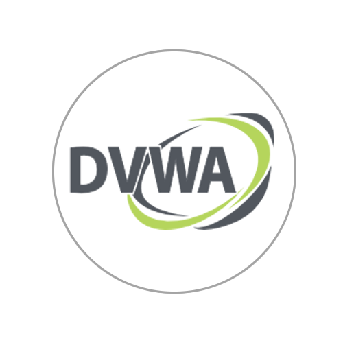

# DVWA (Damn Vulnerable Web Application) Walkthrough

A comprehensive penetration testing and code review guide for the Damn Vulnerable Web Application (DVWA). This repository documents the exploitation of OWASP Top 10 vulnerabilities across multiple security levels (Low, Medium, High) alongside backend PHP source code analysis to understand remediation strategies.

## 📖 Walkthrough Documentation

* [Install and configure DVWA](./install-and-configure-dvwa.md)
* [Command Injection](./command-injection.md)
* [Cross Site Request Forgery (CSRF)](./csrf.md)
* [File Inclusion (LFI + RFI)](./file-inclusion.md)
* [SQL Injection (SQLi)](./sql-injection.md)
* [SQL Injection Blind](./sqli-blind.md)

---
**Disclaimer:** This repository is for educational purposes only. All testing was conducted in a local, isolated lab environment.
