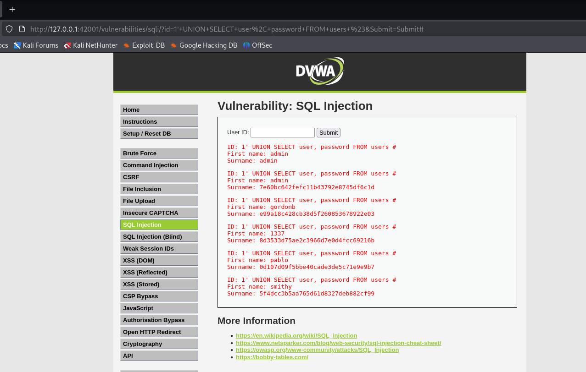
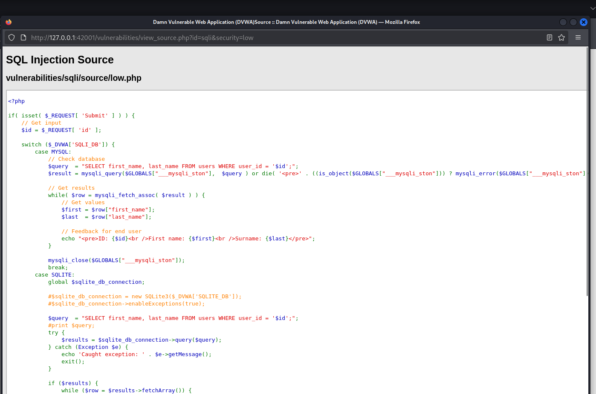
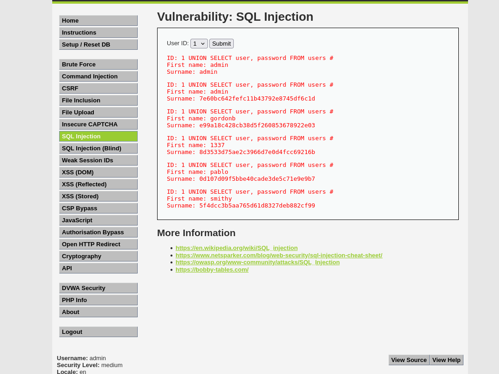
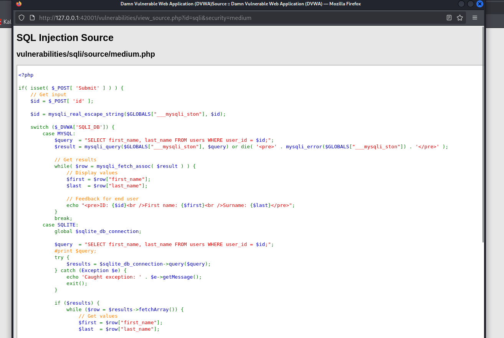
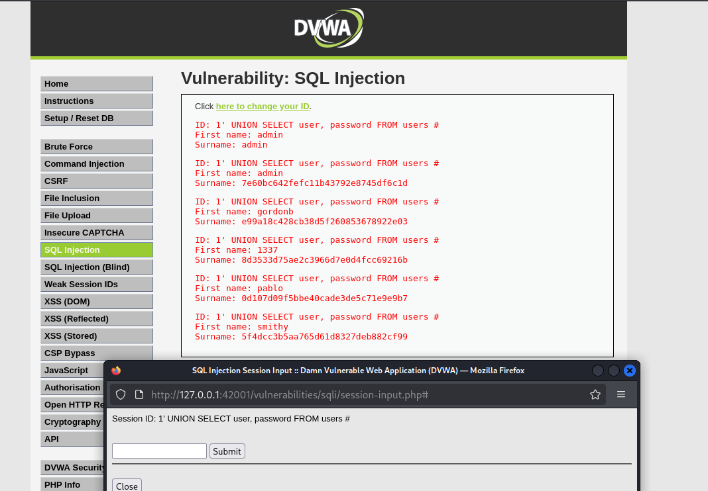
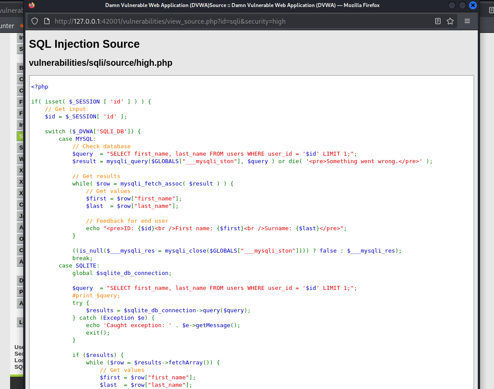

# SQL Injection (SQLi)

SQL Injection (SQLi) is a severe vulnerability that occurs when an application improperly sanitizes user input before inserting it into a backend database query. This allows an attacker to manipulate the SQL statement to view, modify, or delete database records, and in some cases, gain administrative access.

---

## Security Level: Low

**The Exploit:**
The application takes a user ID from a text field and inserts it directly into the SQL query. By inputting a single quote (`'`), we can break out of the expected data field and inject our own SQL logic. Using a `UNION SELECT` statement allows us to append the results of a second query (like extracting usernames and passwords) to the original output.
**Payload Used:** `1' UNION SELECT user, password FROM users #`

<details>
<summary><b>📸 View Exploit & Source Code</b></summary>
<br>

**Execution Output:**


**Source Code:**

</details>

**Code Analysis:**
The backend PHP code is completely vulnerable to string manipulation:
```php
$id = $_REQUEST[ 'id' ];
$query  = "SELECT first_name, last_name FROM users WHERE user_id = '$id';";
```
Because the input is wrapped in single quotes in the query, our injected `'` closes the developer's quote, allowing our `UNION SELECT` to execute as valid SQL syntax. The `#` comments out the remainder of the original query.

---

## Security Level: Medium

**The Exploit:**
The developer changed the input method from a text box to a dropdown menu, forcing a POST request, and added `mysqli_real_escape_string()` to sanitize quotes. However, because the input is treated as an integer in the query, we do not need quotes to perform an injection. We can intercept the POST request using a proxy tool (like Burp Suite or browser DevTools) and inject our payload directly into the `id` parameter.
**Payload Used:** `1 UNION SELECT user, password FROM users #`

<details>
<summary><b>📸 View Exploit & Source Code</b></summary>
<br>

**Execution Output (Burp Suite Intercept):**


**Source Code:**

</details>

**Code Analysis:**
The developer attempted to sanitize the input using an escape function:
```php
$id = mysqli_real_escape_string($GLOBALS["___mysqli_ston"], $id);
$query  = "SELECT first_name, last_name FROM users WHERE user_id = $id;";
```
**The Flaw:** Notice that `$id` in the SQL query does *not* have quotes around it. Escaping quotes is useless if the attacker doesn't need to use quotes to break out of the query.

---

## Security Level: High

**The Exploit:**
The application attempts to thwart attackers and automated tools (like SQLmap) by moving the input form to a separate window. The input is stored in a session variable and then executed on the main page. Furthermore, the query adds a `LIMIT 1` clause to restrict output. However, the backend still lacks actual input sanitization. We can inject our standard payload and use `#` to comment out the `LIMIT` restriction.
**Payload Used:** `1' UNION SELECT user, password FROM users #`

<details>
<summary><b>📸 View Exploit & Source Code</b></summary>
<br>

**Execution Output:**


**Source Code:**

</details>

**Code Analysis:**
The developer relied on workflow obfuscation rather than data sanitization:
```php
$id = $_SESSION[ 'id' ];
$query  = "SELECT first_name, last_name FROM users WHERE user_id = '$id' LIMIT 1;";
```
Moving the input to a session variable breaks basic automated scanners, but does nothing to stop a manual attack. The `'` breaks the query, and the `#` safely ignores the `LIMIT 1;` mechanism.

---

## Security Level: Impossible (Secure)

**The Remediation:**
The application is fully secure against SQL Injection. Malicious payloads are safely treated as strings rather than executable SQL commands.

<details>
<summary><b>📸 View Secure Source Code</b></summary>
<br>


</details>

**Code Analysis:**
The developer implemented the industry standard for preventing SQLi: **Prepared Statements (Parameterized Queries)** using PDO (PHP Data Objects).
```php
$data = $db->prepare( 'SELECT first_name, last_name FROM users WHERE user_id = (:id) LIMIT 1;' );
$data->bindParam( ':id', $id, PDO::PARAM_INT );
$data->execute();
```
By using `prepare()` and `bindParam()`, the database engine compiles the SQL query structure *before* inserting the user input. The input (`:id`) is strictly treated as data (an integer), making it mathematically impossible for the database to interpret a payload as executable code.
